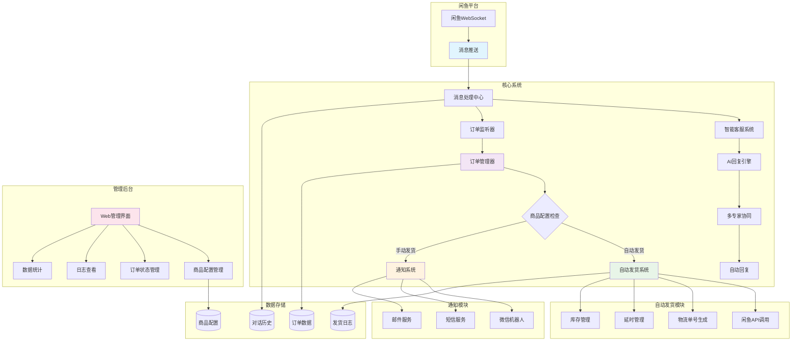
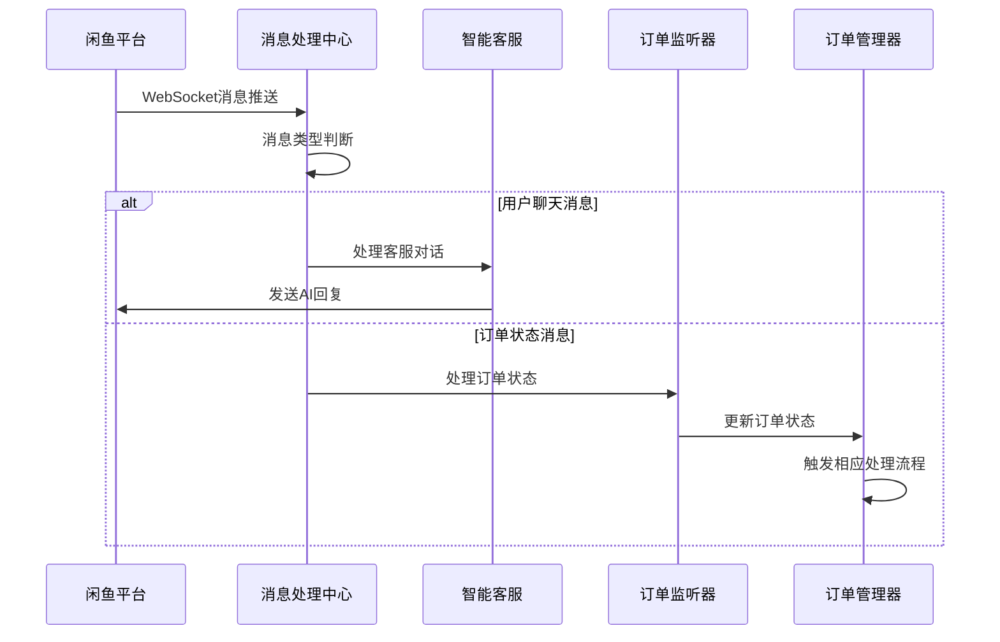
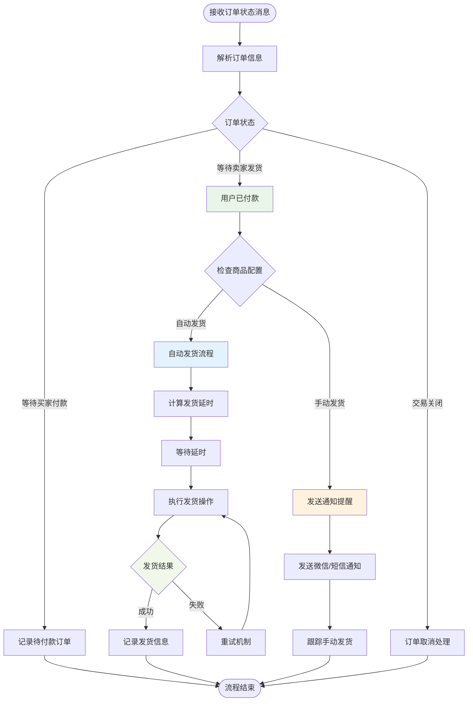
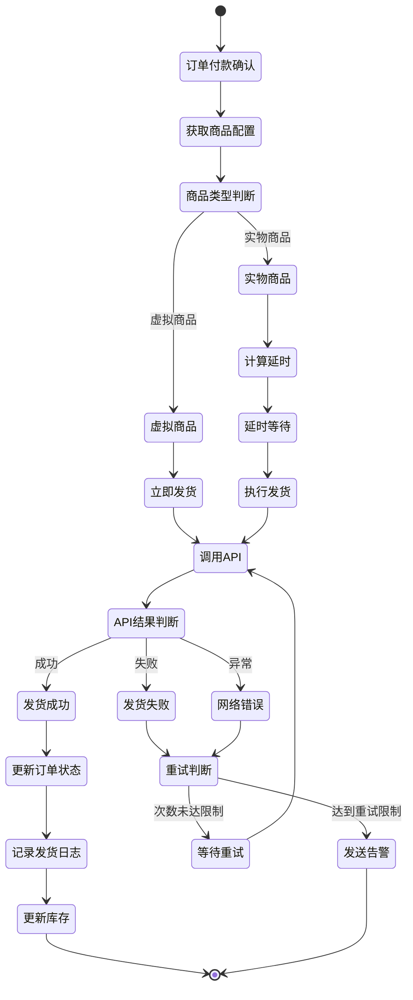

# 🏗️ 闲鱼店铺自动化管理系统架构文档

## 📋 系统概览

基于现有闲鱼智能客服系统的扩展，集成订单自动化处理、商品管理和通知系统，构建完整的闲鱼店铺自动化管理平台。

---

## 🎯 系统架构图



---

## 🔄 核心业务流程

### 1. 消息处理流程



### 2. 订单处理流程



### 3. 自动发货详细流程



---

## 🏛️ 系统分层架构

### 1. 表现层 (Presentation Layer)
```
├── Web管理界面
│   ├── 商品配置管理页面
│   ├── 订单监控页面  
│   ├── 系统状态监控页面
│   └── 数据统计报表页面
└── API接口
    ├── RESTful API
    └── WebSocket接口
```

### 2. 业务逻辑层 (Business Logic Layer)
```
├── 消息处理服务
│   ├── 聊天消息处理器
│   └── 订单消息处理器
├── 智能客服服务
│   ├── AI回复引擎
│   └── 多专家协同系统
├── 订单管理服务
│   ├── 订单状态管理
│   ├── 自动发货处理
│   └── 手动发货提醒
├── 商品配置服务
│   ├── 商品配置管理
│   └── 库存管理
└── 通知服务
    ├── 微信通知
    ├── 短信通知
    └── 邮件通知
```

### 3. 数据访问层 (Data Access Layer)
```
├── 对话历史数据访问
├── 订单数据访问
├── 商品配置数据访问
└── 系统日志数据访问
```

### 4. 数据存储层 (Data Storage Layer)
```
├── SQLite数据库
│   ├── chat_history.db (对话历史)
│   ├── orders.db (订单数据)
│   ├── product_configs.db (商品配置)
│   └── system_logs.db (系统日志)
└── 配置文件存储
    ├── .env (环境配置)
    └── prompts/ (AI提示词)
```

---

## 🔧 核心组件设计

### 1. 消息处理中心 (MessageProcessor)

```python
class MessageProcessor:
    """消息处理中心 - 系统的核心调度器"""
    
    def __init__(self):
        self.chat_handler = ChatMessageHandler()
        self.order_handler = OrderMessageHandler()
        self.context_manager = ChatContextManager()
        
    async def process_message(self, message: dict) -> None:
        """统一消息处理入口"""
        message_type = self.identify_message_type(message)
        
        if message_type == MessageType.CHAT:
            await self.chat_handler.handle(message)
        elif message_type == MessageType.ORDER:
            await self.order_handler.handle(message)
        elif message_type == MessageType.SYSTEM:
            await self.system_handler.handle(message)
```

### 2. 订单管理器 (OrderManager)

```python
class OrderManager:
    """订单管理器 - 订单业务逻辑核心"""
    
    def __init__(self):
        self.config_manager = ProductConfigManager()
        self.auto_ship_system = AutoShipSystem()
        self.notification_system = NotificationSystem()
        self.order_db = OrderDatabase()
        
    async def handle_payment_confirmed(self, order_info: dict) -> None:
        """处理付款确认事件"""
        
        # 1. 保存订单信息
        await self.order_db.save_order(order_info)
        
        # 2. 获取商品配置
        product_config = await self.config_manager.get_config(
            order_info['item_id']
        )
        
        # 3. 根据配置决定处理方式
        if product_config and product_config.auto_ship:
            await self.auto_ship_system.schedule_ship(order_info, product_config)
        else:
            await self.notification_system.send_manual_ship_alert(order_info)
```

### 3. 自动发货系统 (AutoShipSystem)

```python
class AutoShipSystem:
    """自动发货系统 - 核心自动化组件"""
    
    def __init__(self):
        self.xianyu_api = XianyuApis()
        self.pending_tasks = {}  # 待执行的发货任务
        self.retry_manager = RetryManager()
        
    async def schedule_ship(self, order_info: dict, config: dict) -> None:
        """调度发货任务"""
        
        # 计算发货延时
        delay_minutes = self.calculate_ship_delay(config)
        
        # 创建异步发货任务
        task = asyncio.create_task(
            self.execute_delayed_ship(order_info, config, delay_minutes)
        )
        
        # 管理任务生命周期
        self.pending_tasks[order_info['order_id']] = task
        
    async def execute_delayed_ship(self, order_info: dict, config: dict, delay: int) -> None:
        """执行延时发货"""
        
        # 等待延时
        await asyncio.sleep(delay * 60)
        
        # 执行发货操作
        result = await self.ship_with_retry(order_info, config)
        
        # 处理结果
        await self.handle_ship_result(order_info, result)
```

### 4. 通知系统 (NotificationSystem)

```python
class NotificationSystem:
    """通知系统 - 多渠道消息推送"""
    
    def __init__(self):
        self.wechat_bot = WeChatBot()
        self.sms_service = SMSService()
        self.email_service = EmailService()
        
    async def send_manual_ship_alert(self, order_info: dict) -> bool:
        """发送手动发货提醒"""
        
        message = self.format_ship_alert_message(order_info)
        
        # 优先级通知策略
        success = await self.wechat_bot.send_message(message)
        
        if not success:
            success = await self.sms_service.send_sms(
                self.config.phone_number, message
            )
            
        if not success:
            success = await self.email_service.send_email(
                self.config.email, "发货提醒", message
            )
            
        return success
```

---

## 📊 数据模型设计

### 1. 订单数据模型

```python
@dataclass
class Order:
    """订单数据模型"""
    order_id: str
    chat_id: str
    user_id: str
    item_id: str
    item_title: str
    amount: float
    status: OrderStatus
    payment_time: datetime
    ship_time: Optional[datetime] = None
    ship_method: Optional[str] = None
    logistics_company: Optional[str] = None
    tracking_number: Optional[str] = None
    created_time: datetime = field(default_factory=datetime.now)
    updated_time: datetime = field(default_factory=datetime.now)
```

### 2. 商品配置数据模型

```python
@dataclass
class ProductConfig:
    """商品配置数据模型"""
    item_id: str
    title: str
    category: ProductCategory
    auto_ship: bool = False
    ship_delay_min: int = 5
    ship_delay_max: int = 30
    logistics_company: str = "顺丰快递"
    ship_template: Optional[str] = None
    stock_quantity: int = -1  # -1表示无限库存
    status: ProductStatus = ProductStatus.ACTIVE
    created_time: datetime = field(default_factory=datetime.now)
    updated_time: datetime = field(default_factory=datetime.now)
```

### 3. 发货日志数据模型

```python
@dataclass
class ShipLog:
    """发货日志数据模型"""
    id: Optional[int] = None
    order_id: str = ""
    action: str = ""  # scheduled, executed, succeeded, failed, retried
    result: str = ""
    error_msg: Optional[str] = None
    retry_count: int = 0
    created_time: datetime = field(default_factory=datetime.now)
```

---

## 🔀 状态管理设计

### 1. 订单状态机

```python
class OrderStatus(Enum):
    """订单状态枚举"""
    PENDING_PAYMENT = "等待买家付款"
    PENDING_SHIP = "等待卖家发货"
    SHIPPED = "已发货"
    COMPLETED = "交易成功"
    CANCELLED = "交易关闭"
    REFUNDING = "退款中"

class OrderStateMachine:
    """订单状态机"""
    
    # 状态转换规则
    TRANSITIONS = {
        OrderStatus.PENDING_PAYMENT: [
            OrderStatus.PENDING_SHIP,  # 用户付款
            OrderStatus.CANCELLED      # 订单取消
        ],
        OrderStatus.PENDING_SHIP: [
            OrderStatus.SHIPPED,       # 卖家发货
            OrderStatus.REFUNDING      # 申请退款
        ],
        OrderStatus.SHIPPED: [
            OrderStatus.COMPLETED,     # 确认收货
            OrderStatus.REFUNDING      # 申请退款
        ],
        # ... 其他转换规则
    }
    
    def can_transition(self, from_status: OrderStatus, to_status: OrderStatus) -> bool:
        """检查状态转换是否合法"""
        return to_status in self.TRANSITIONS.get(from_status, [])
```

### 2. 发货任务状态

```python
class ShipTaskStatus(Enum):
    """发货任务状态"""
    SCHEDULED = "已调度"
    WAITING = "等待中"
    EXECUTING = "执行中"
    SUCCEEDED = "成功"
    FAILED = "失败"
    CANCELLED = "已取消"

@dataclass
class ShipTask:
    """发货任务"""
    order_id: str
    status: ShipTaskStatus
    scheduled_time: datetime
    execute_time: Optional[datetime] = None
    retry_count: int = 0
    error_msg: Optional[str] = None
```

---

## 🔄 异步处理架构

### 1. 异步任务管理

```python
class TaskManager:
    """异步任务管理器"""
    
    def __init__(self):
        self.running_tasks = {}
        self.task_queue = asyncio.Queue()
        self.worker_pool = []
        
    async def start_workers(self, worker_count: int = 3) -> None:
        """启动工作进程池"""
        for i in range(worker_count):
            worker = asyncio.create_task(self.worker_loop(f"worker-{i}"))
            self.worker_pool.append(worker)
            
    async def worker_loop(self, worker_name: str) -> None:
        """工作进程循环"""
        while True:
            try:
                task = await self.task_queue.get()
                await self.execute_task(task)
                self.task_queue.task_done()
            except Exception as e:
                logger.error(f"{worker_name} 执行任务异常: {e}")
```

### 2. 消息队列设计

```python
class MessageQueue:
    """消息队列系统"""
    
    def __init__(self):
        self.chat_queue = asyncio.Queue(maxsize=1000)
        self.order_queue = asyncio.Queue(maxsize=500)
        self.notification_queue = asyncio.Queue(maxsize=200)
        
    async def publish(self, queue_name: str, message: dict) -> None:
        """发布消息到队列"""
        queue = getattr(self, f"{queue_name}_queue")
        await queue.put(message)
        
    async def subscribe(self, queue_name: str) -> dict:
        """从队列订阅消息"""
        queue = getattr(self, f"{queue_name}_queue")
        return await queue.get()
```

---

## 🛡️ 错误处理架构

### 1. 异常分类体系

```python
class SystemException(Exception):
    """系统异常基类"""
    pass

class NetworkException(SystemException):
    """网络相关异常"""
    pass

class APIException(SystemException):
    """API调用异常"""
    pass

class BusinessException(SystemException):
    """业务逻辑异常"""
    pass

class ConfigException(SystemException):
    """配置相关异常"""
    pass
```

### 2. 重试机制设计

```python
class RetryManager:
    """重试管理器"""
    
    def __init__(self):
        self.max_retries = 3
        self.base_delay = 1
        self.max_delay = 60
        
    async def retry_with_backoff(self, func, *args, **kwargs):
        """指数退避重试"""
        for attempt in range(self.max_retries + 1):
            try:
                return await func(*args, **kwargs)
            except Exception as e:
                if attempt == self.max_retries:
                    raise e
                    
                delay = min(self.base_delay * (2 ** attempt), self.max_delay)
                logger.warning(f"第{attempt + 1}次重试失败，{delay}秒后重试: {e}")
                await asyncio.sleep(delay)
```

---

## 📈 性能优化设计

### 1. 数据库连接池

```python
class DatabasePool:
    """数据库连接池"""
    
    def __init__(self, db_path: str, pool_size: int = 10):
        self.db_path = db_path
        self.pool = asyncio.Queue(maxsize=pool_size)
        self.pool_size = pool_size
        
    async def initialize(self):
        """初始化连接池"""
        for _ in range(self.pool_size):
            conn = sqlite3.connect(self.db_path)
            await self.pool.put(conn)
```

### 2. 缓存策略

```python
class CacheManager:
    """缓存管理器"""
    
    def __init__(self):
        self.product_config_cache = {}
        self.cache_ttl = 3600  # 1小时
        self.cache_timestamps = {}
        
    async def get_product_config(self, item_id: str) -> Optional[dict]:
        """获取商品配置（带缓存）"""
        if self.is_cache_valid(item_id):
            return self.product_config_cache.get(item_id)
            
        # 从数据库加载并缓存
        config = await self.load_from_db(item_id)
        if config:
            self.set_cache(item_id, config)
        return config
```

---

## 🔒 安全性设计

### 1. 敏感信息保护

```python
class SecurityManager:
    """安全管理器"""
    
    def __init__(self):
        self.encryption_key = self.load_encryption_key()
        
    def encrypt_sensitive_data(self, data: str) -> str:
        """加密敏感数据"""
        # 实现数据加密逻辑
        pass
        
    def decrypt_sensitive_data(self, encrypted_data: str) -> str:
        """解密敏感数据"""
        # 实现数据解密逻辑
        pass
```

### 2. API访问控制

```python
class APIAuthManager:
    """API访问控制管理器"""
    
    def __init__(self):
        self.rate_limiter = RateLimiter()
        self.auth_tokens = set()
        
    def verify_token(self, token: str) -> bool:
        """验证访问令牌"""
        return token in self.auth_tokens
        
    async def check_rate_limit(self, client_id: str) -> bool:
        """检查访问频率限制"""
        return await self.rate_limiter.is_allowed(client_id)
```

---

这个架构文档详细描述了系统的设计理念、核心组件、数据流向和技术实现方案，为后续的具体开发提供了完整的技术指导。