# 🔄 闲鱼店铺自动化管理系统工作流程

## 📋 总体业务流程概览

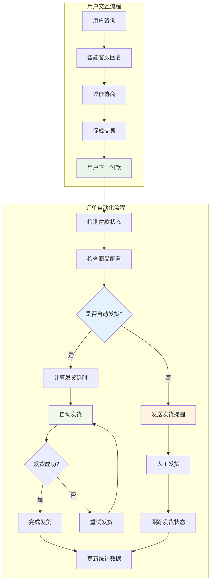

---

## 🎯 详细工作流程

### 1. 用户咨询处理流程

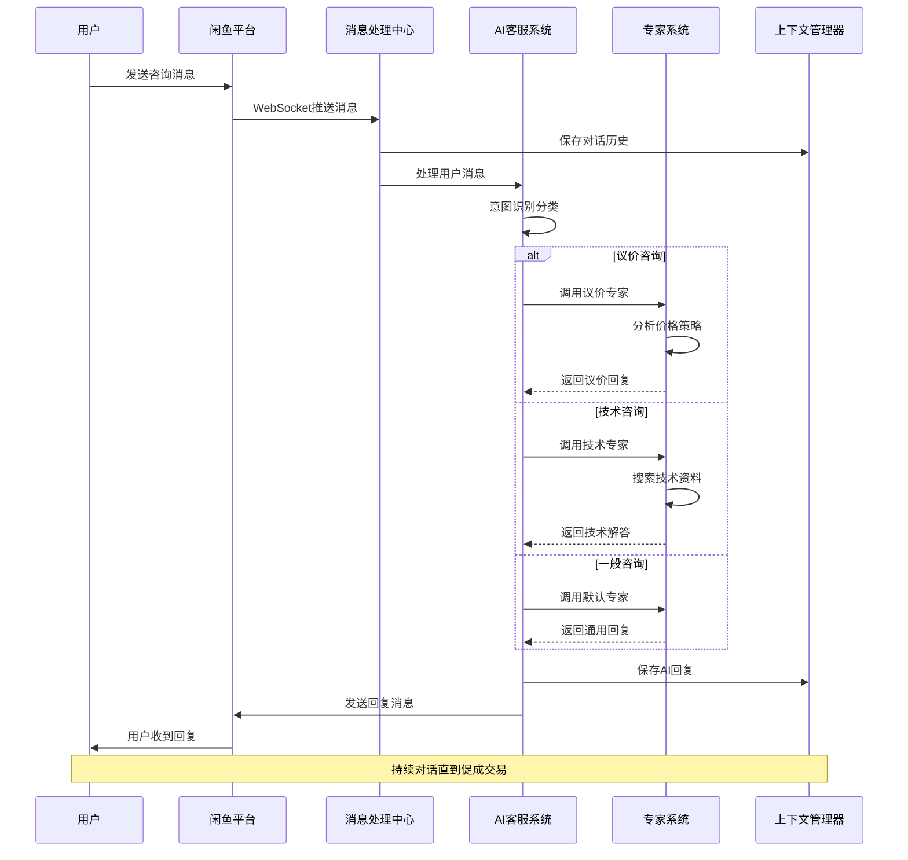

### 2. 订单状态监听流程

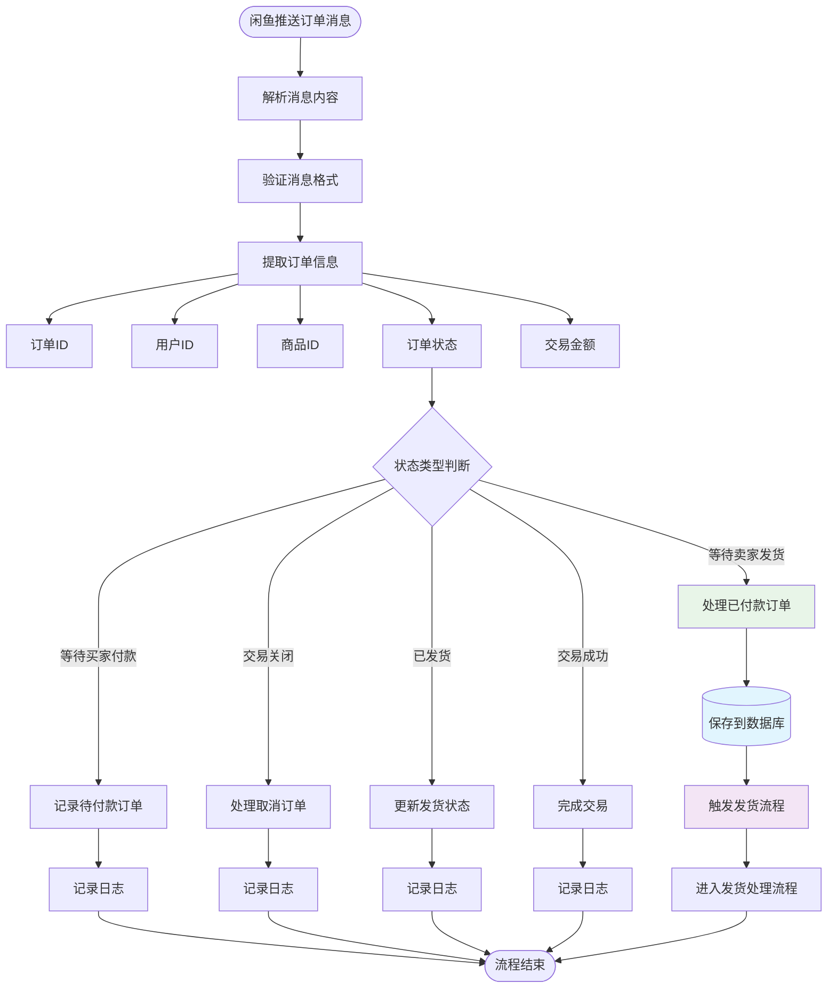

### 3. 自动发货处理流程

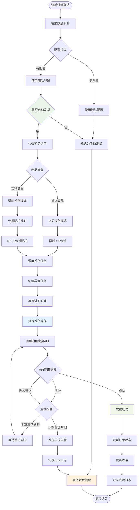

### 4. 通知系统处理流程

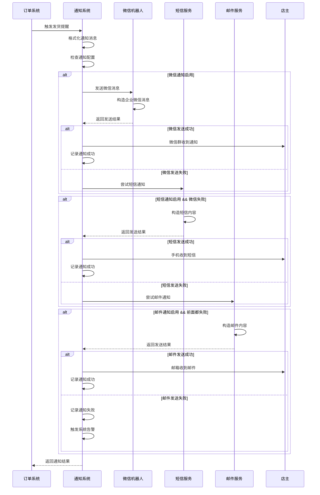

---

## ⚙️ 配置管理流程

### 1. 商品配置管理流程

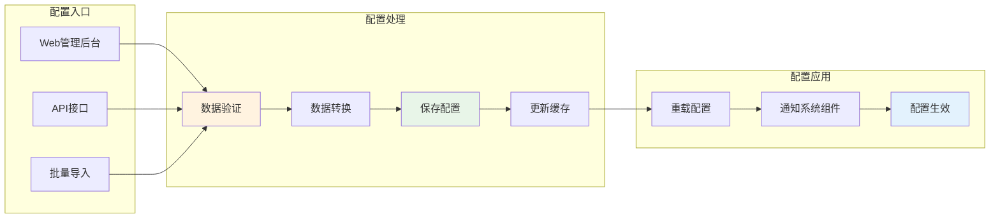

### 2. 系统配置加载流程

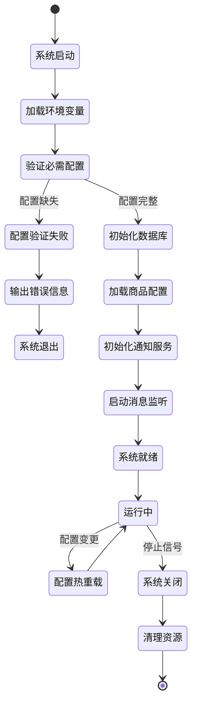

---

## 📊 数据处理流程

### 1. 数据库操作流程

```mermaid
graph TD
    subgraph "数据写入流程"
        WRITE_REQ[写入请求] --> VALIDATE_DATA[数据验证]
        VALIDATE_DATA --> TRANSFORM_DATA[数据转换]
        TRANSFORM_DATA --> BEGIN_TX[开始事务]
        BEGIN_TX --> INSERT_DB[插入数据库]
        INSERT_DB --> COMMIT_TX[提交事务]
        COMMIT_TX --> UPDATE_CACHE[更新缓存]
        UPDATE_CACHE --> WRITE_SUCCESS[写入成功]
    end
    
    subgraph "数据读取流程"
        READ_REQ[读取请求] --> CHECK_CACHE[检查缓存]
        CHECK_CACHE --> CACHE_HIT{缓存命中?}
        CACHE_HIT -->|是| RETURN_CACHE[返回缓存数据]
        CACHE_HIT -->|否| QUERY_DB[查询数据库]
        QUERY_DB --> SET_CACHE[设置缓存]
        SET_CACHE --> RETURN_DATA[返回数据]
    end
    
    subgraph "数据同步流程"
        DATA_CHANGE[数据变更] --> INVALIDATE_CACHE[失效缓存]
        INVALIDATE_CACHE --> NOTIFY_SUBSCRIBERS[通知订阅者]
        NOTIFY_SUBSCRIBERS --> UPDATE_VIEWS[更新视图]
    end
    
    style COMMIT_TX fill:#e8f5e8
    style CACHE_HIT fill:#e3f2fd
    style UPDATE_VIEWS fill:#f3e5f5
```

### 2. 库存管理流程

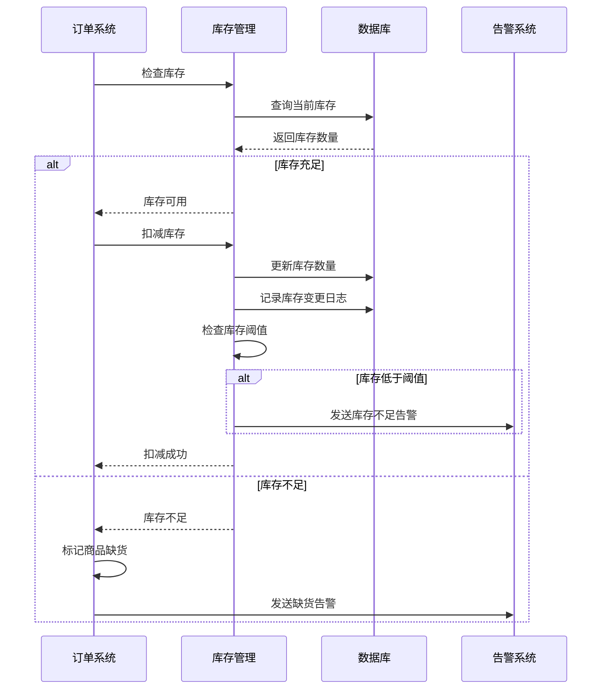

---

## 🔧 异常处理流程

### 1. 系统异常处理流程

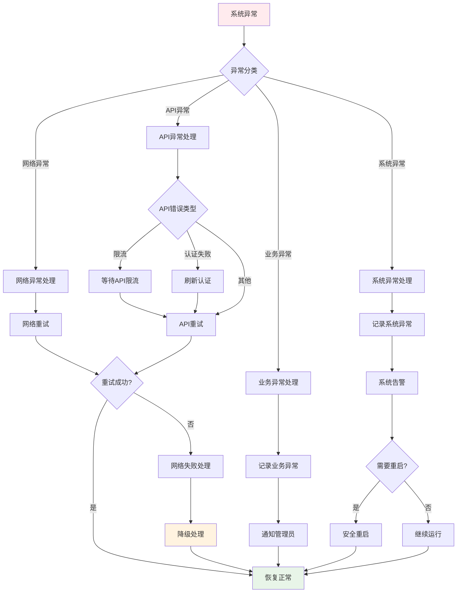

### 2. 发货失败处理流程

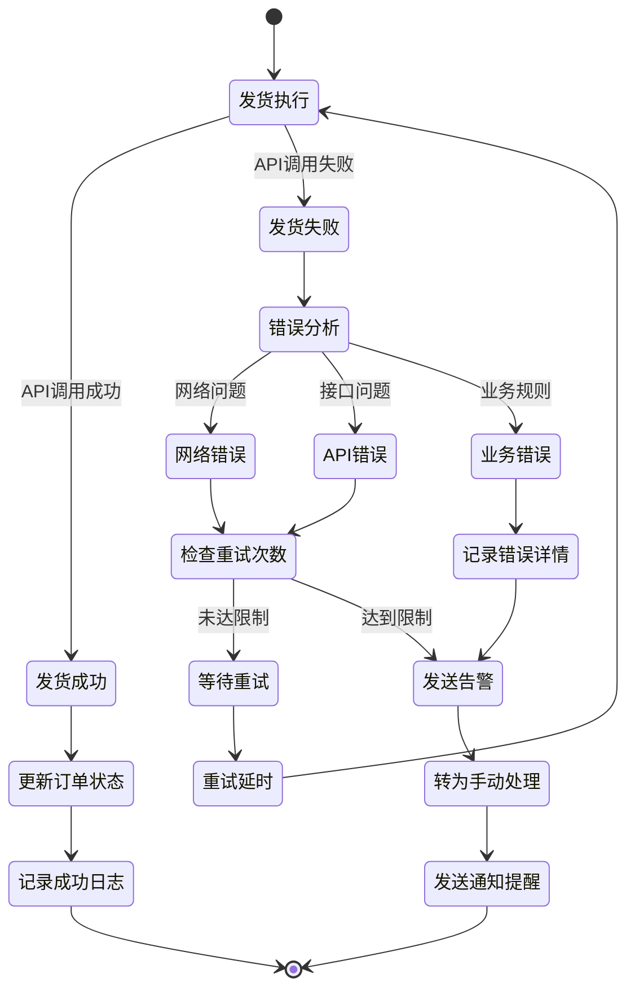

---

## 📈 监控告警流程

### 1. 系统监控流程

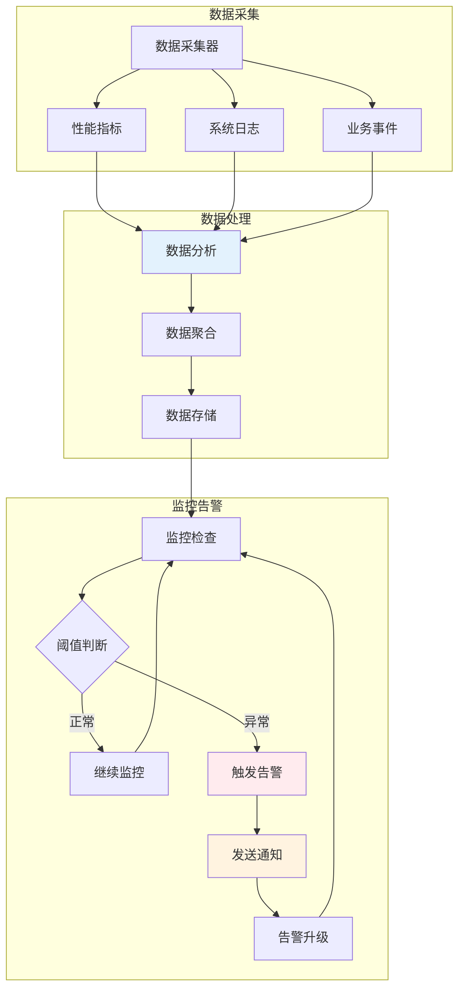

### 2. 性能监控指标

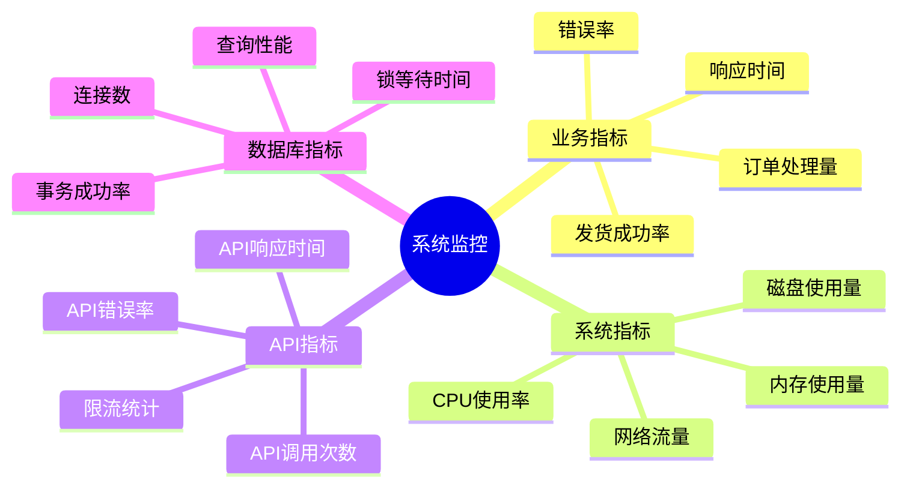

---

## 🎯 关键性能指标 (KPI)

### 1. 业务KPI监控

| 指标名称 | 目标值 | 告警阈值 | 监控频率 |
|---------|--------|---------|----------|
| 自动发货成功率 | ≥95% | <90% | 实时 |
| 订单处理延迟 | ≤5分钟 | >10分钟 | 实时 |
| 通知发送成功率 | ≥99% | <95% | 实时 |
| 系统可用性 | ≥99.9% | <99% | 实时 |
| API响应时间 | ≤2秒 | >5秒 | 实时 |

### 2. 技术KPI监控

| 指标名称 | 目标值 | 告警阈值 | 监控频率 |
|---------|--------|---------|----------|
| 内存使用率 | ≤80% | >90% | 每分钟 |
| CPU使用率 | ≤70% | >85% | 每分钟 |
| 磁盘使用率 | ≤80% | >90% | 每小时 |
| 数据库连接数 | ≤50 | >80 | 每分钟 |
| 错误日志数量 | ≤10/小时 | >50/小时 | 每小时 |

---

这个工作流程文档详细描述了系统运行的各个环节，从用户交互到订单处理，从异常处理到性能监控，为理解和维护系统提供了完整的流程指导。